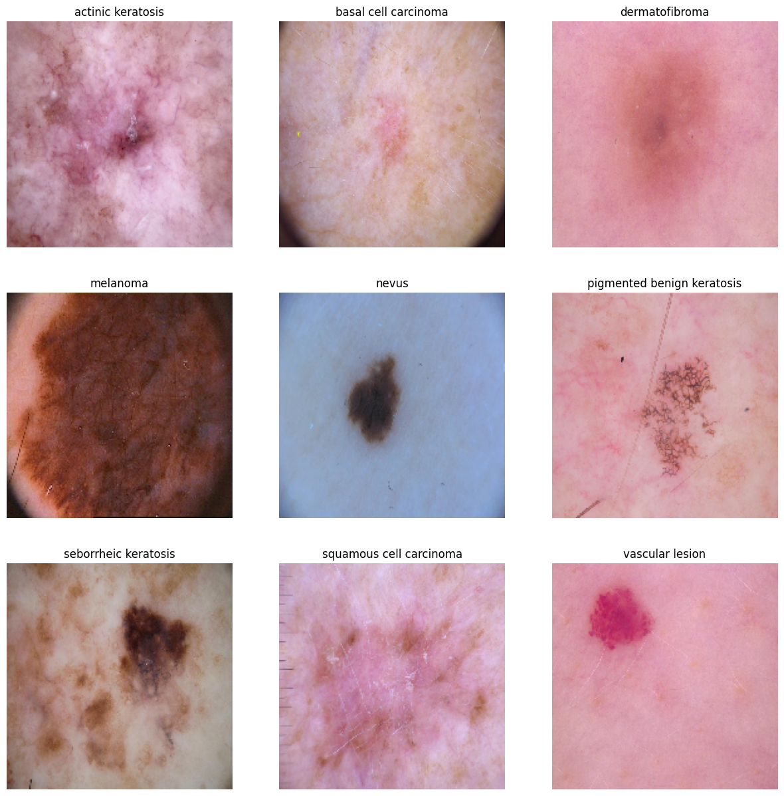

# Melanoma Detection Using CNN
> The goal of this project is to develop a Convolutional Neural Network (CNN)-based model capable of accurately detecting melanoma from skin lesion images. Melanoma is a type of skin cancer that, if not detected early, can be fatal. This model aims to assist dermatologists by automating the process of identifying melanoma, thereby reducing manual effort and potentially saving lives through early detection.


## Table of Contents
* [General Info](#general-information)
* [Conclusions](#conclusions)
* [Technologies Used](#technologies-used)


<!-- You can include any other section that is pertinent to your problem -->

## General Information
Melanoma is the deadliest form of skin cancer, and early detection significantly improves survival rates. AI can assist in detecting melanoma at its earliest stages, even when it may not be easily noticeable to the human eye. This can lead to quicker intervention and more effective treatments.

The traditional way of detecting melanoma is time taking and in early stages it is hard to detect.
Limitations with the traditional approach:
- Subjectivity: The visual diagnosis relies heavily on the dermatologist's experience, which can lead to errors, especially with subtle or early-stage melanomas.
- Time-Consuming: Analyzing large volumes of skin lesions in a clinical setting can be time-consuming.
- Access: Limited access to dermatologists in some regions means fewer patients get timely screenings.

## Business value
AI-based systems, particularly Convolutional Neural Networks (CNNs), can be developed to automatically analyze skin lesion images and detect melanoma and other types of skin cancer. The system would provide an initial screening, flagging suspicious lesions for further review by dermatologists.
This will increase the cost efficiency and enable faster diagnosis.


## What is the dataset that is being used?
The dataset used for this project contains 2,357 images of various skin diseases, with each image classified into one of the following categories:

- Actinic keratosis
- Basal cell carcinoma
- Dermatofibroma
- Melanoma (target class)
- Nevus (mole)
- Pigmented benign keratosis
- Seborrheic keratosis
- Squamous cell carcinoma
- Vascular lesion

The images were obtained from the International Skin Imaging Collaboration (ISIC) and are sorted by their classification. While the dataset includes various benign and malignant skin conditions, melanoma is the focal point of the project, as it accounts for the majority of skin cancer deaths.


## CNN Architecture followed
The convolutional neural network (CNN) is built using Keras' Sequential API. Let's break it down step by step:

- Sequential Model:
The model is created using the Sequential API, which allows you to build a neural network layer by layer.

- Rescaling Layer:
model.add(layers.Rescaling(1./255, input_shape=(180, 180, 3))): This rescales the input image data from the range [0, 255] to [0, 1] by dividing each pixel value by 255. The input shape is (180, 180, 3), which indicates that the images are of size 180x180 pixels with 3 color channels (RGB).

- First Convolutional Layer:
    ```
    model.add(layers.Conv2D(32, kernel_size=(3, 3), activation='relu'))
    ```
    This adds a 2D convolutional layer with 32 filters (or kernels), each of size 3x3. The activation function used is ReLU (Rectified Linear Unit), which helps introduce non-linearity.

    ```
    model.add(layers.MaxPool2D(pool_size=(2, 2)))
    ```
    This adds a max pooling layer with a pool size of 2x2, which reduces the spatial dimensions (height and width) by a factor of 2.

- Second Convolutional Layer:
    ```
    model.add(layers.Conv2D(64, kernel_size=(3, 3), activation='relu'))
    ```
    This is another convolutional layer, but now with 64 filters of size 3x3.
    ```
    model.add(layers.MaxPool2D(pool_size=(2, 2)))
    ```
    Max pooling layer to reduce spatial dimensions.

- Third Convolutional Layer:
    ```
    model.add(layers.Conv2D(128, kernel_size=(3, 3), activation='relu'))
    ``` 
    Third convolutional layer with 128 filters.
    ```
    model.add(layers.MaxPool2D(pool_size=(2, 2)))
    ```
    Max pooling layer again to reduce spatial dimensions further.

- Dropout Layer:
    ```
    model.add(layers.Dropout(0.5))
    ``` 
    A dropout layer with a 50% dropout rate, meaning half of the units in this layer will be randomly dropped during training to prevent overfitting.

- Flatten Layer:
    ```
    model.add(layers.Flatten())
    ```
    This flattens the output from the previous layer (which is 3D) into a 1D vector to prepare it for the fully connected (dense) layers.

- First Dense Layer:
    ```
    model.add(layers.Dense(128, activation='relu'))
    ```
    A fully connected layer with 128 units and ReLU activation function.

- Dropout Layer:
    ```
    model.add(layers.Dropout(0.25))
    ```
    Another dropout layer, but this time with a 25% dropout rate.

- Output Dense Layer:
    ```
    model.add(layers.Dense(len(class_names), activation='softmax'))
    ```
    The final output layer with a number of neurons equal to the number of classes (len(class_names)). It uses the softmax activation function, which converts the output into probability values for each class.

Model Summary

## Conclusions
- The data set shows signs of class imbalance, this has been resolved by using augmentor


- Model Evaluation

- The model gradually improved in performance throughout the training, with the validation accuracy (val_accuracy) steadily increasing up to epoch 42 and peaking at 0.78916 (epoch 42). After epoch 42, the validation accuracy plateaued, with minor fluctuations (a slight decrease in later epochs).
- Test accuracy: 44%

<!-- You don't have to answer all the questions - just the ones relevant to your project. -->


## Technologies Used
- Python
- pandas - 2.2.2
- numpy - 1.26.4
- matplotlib - 3.10.0
- seaborn - 0.13.2
- tensorflow - 2.17.1
- keras - 3.5.0
- Augmentor - 0.2.12


<!-- As the libraries versions keep on changing, it is recommended to mention the version of library used in this project -->


<!-- Optional -->
<!-- ## License -->
<!-- This project is open source and available under the [... License](). -->

<!-- You don't have to include all sections - just the one's relevant to your project -->
